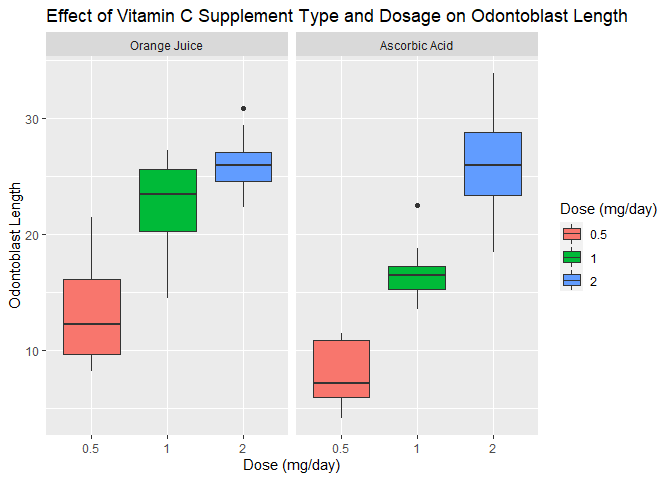

## Overview

In this project, I will perform some basic exploratory data analyses on the ToothGrowth data. Then, I will use confidence intervals to compare tooth growth by supplement type and dose.


## Exploratory data analysis

The data consists of 60 observations of 3 variables. The first variable is a numeric value "len", corresponding to the length of odontoblasts, with minimum value of 4.20, maximum value of 33.9 and mean value 18.81. The second variable is "supp", consisting on factors with two levels: OJ (orange juice) and VC (ascorbic acid), with 30 observations each. The third variable is "dose", with minimum value of 0.5, maximum value of 2.0 and mean value of 1.167. There are 20 observations for each of the dose levels: 0.5, 1 and 2 (mg/day).


```r
library(datasets)
data <- ToothGrowth
?ToothGrowth
```

```
## starting httpd help server ... done
```

```r
dim(data)
```

```
## [1] 60  3
```

```r
str(data)
```

```
## 'data.frame':	60 obs. of  3 variables:
##  $ len : num  4.2 11.5 7.3 5.8 6.4 10 11.2 11.2 5.2 7 ...
##  $ supp: Factor w/ 2 levels "OJ","VC": 2 2 2 2 2 2 2 2 2 2 ...
##  $ dose: num  0.5 0.5 0.5 0.5 0.5 0.5 0.5 0.5 0.5 0.5 ...
```

```r
head(data)
```

```
##    len supp dose
## 1  4.2   VC  0.5
## 2 11.5   VC  0.5
## 3  7.3   VC  0.5
## 4  5.8   VC  0.5
## 5  6.4   VC  0.5
## 6 10.0   VC  0.5
```

```r
summary(data)
```

```
##       len        supp         dose      
##  Min.   : 4.20   OJ:30   Min.   :0.500  
##  1st Qu.:13.07   VC:30   1st Qu.:0.500  
##  Median :19.25           Median :1.000  
##  Mean   :18.81           Mean   :1.167  
##  3rd Qu.:25.27           3rd Qu.:2.000  
##  Max.   :33.90           Max.   :2.000
```

```r
table(data$dose)
```

```
## 
## 0.5   1   2 
##  20  20  20
```

When plotting the data divided by Supplement Type and dosage, there is evidence of difference between the means of odontoblasts length with the vitamin C dose. Difference between supplement type is not clear.


```r
library(ggplot2)

ggplot(ToothGrowth,aes(x=factor(dose),y=len,fill=factor(dose))) + 
    geom_boxplot() +
    facet_grid(.~supp, labeller = as_labeller(c("OJ" = "Orange Juice", "VC" = "Ascorbic Acid"))) +
    scale_x_discrete("Dose (mg/day)") +   
    scale_y_continuous("Odontoblast Length") +  
    scale_fill_discrete(name="Dose (mg/day)") + 
    ggtitle("Effect of Vitamin C Supplement Type and Dosage on Odontoblast Length")
```

<!-- -->


## Use confidence intervals to compare tooth growth by supp and dose.

#First hypothesis tested: There is no difference between the two supplement types (mean of the difference = 0)


```r
t.test(len ~ supp, paired = FALSE, alternative = "two.sided", var.equal = FALSE, data = data)
```

```
## 
## 	Welch Two Sample t-test
## 
## data:  len by supp
## t = 1.9153, df = 55.309, p-value = 0.06063
## alternative hypothesis: true difference in means is not equal to 0
## 95 percent confidence interval:
##  -0.1710156  7.5710156
## sample estimates:
## mean in group OJ mean in group VC 
##         20.66333         16.96333
```
The p-value is higher than 5%, so we fail to reject the null hypothesis. That means there are no evidence of difference between supplements.


#Second hypothesis tested: There is no difference between the doses 0.5 and 1 (mean of the difference = 0)


```r
dataHalfOne <- subset(data, dose %in% c(0.5, 1))
t.test(len ~ dose, paired = FALSE, alternative = "two.sided", var.equal = FALSE, data = dataHalfOne)
```

```
## 
## 	Welch Two Sample t-test
## 
## data:  len by dose
## t = -6.4766, df = 37.986, p-value = 1.268e-07
## alternative hypothesis: true difference in means is not equal to 0
## 95 percent confidence interval:
##  -11.983781  -6.276219
## sample estimates:
## mean in group 0.5   mean in group 1 
##            10.605            19.735
```
The p-value is smaller than 5%, so we reject the null hypothesis. That means there are evidence of difference between vitamin C doses 0.5 and 1 mg/day. Also the negative confidence interval indicates that a higher dose presents a higher mean for the odontoblasts length.


#Third hypothesis tested: There is no difference between the doses 1 and 2 (mean of the difference = 0)

```r
dataOneTwo <- subset(data, dose %in% c(1, 2))
t.test(len ~ dose, paired = FALSE, alternative = "two.sided", var.equal = FALSE, data = dataOneTwo)
```

```
## 
## 	Welch Two Sample t-test
## 
## data:  len by dose
## t = -4.9005, df = 37.101, p-value = 1.906e-05
## alternative hypothesis: true difference in means is not equal to 0
## 95 percent confidence interval:
##  -8.996481 -3.733519
## sample estimates:
## mean in group 1 mean in group 2 
##          19.735          26.100
```
The p-value is smaller than 5%, so we reject the null hypothesis. That means there are evidence of difference between vitamin C doses 1 and 2 mg/day. Also the negative confidence interval indicates that a higher dose presents a higher mean for the odontoblasts length.


## Conclusions

There are no evidence of difference between the two supplement types. The data and the t-tests indicates a higher mean of odonoblasts length with a bigger vitamin-C dose.
