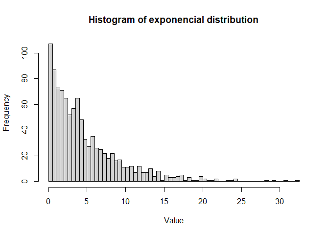
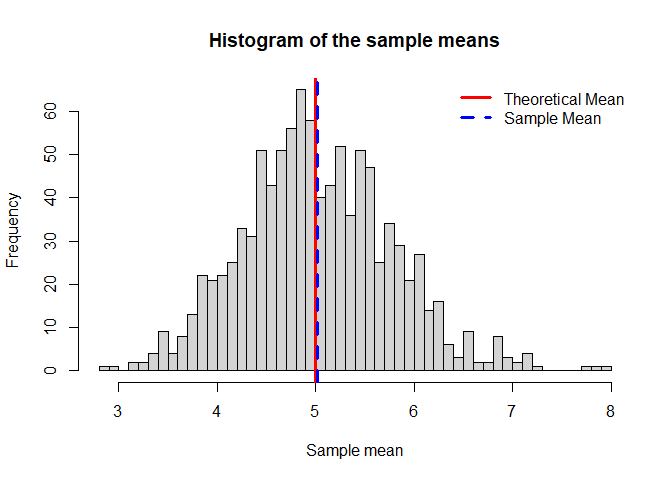
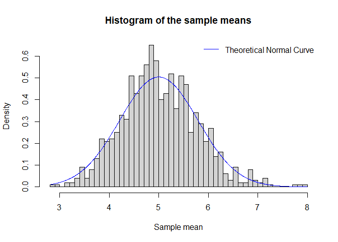
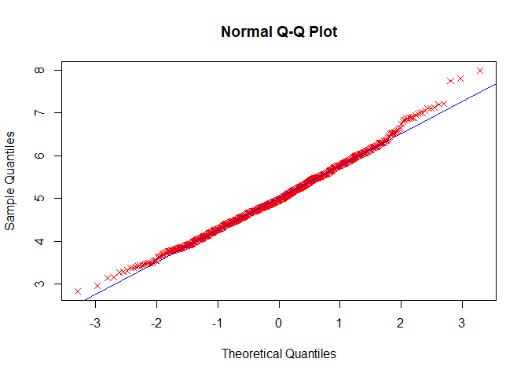

## Overview
In this project I will investigate the exponential distribution in R and compare it with the Central Limit Theorem. The parameter lambda = 0.2 for all of the simulations. I will investigate the distribution of averages of 40 exponentials.


## Simulations

The exponential distribution has the following format, with 1000 values:


```r
set.seed(1992)
hist(rexp(1000, 0.2), breaks = 50, main = "Histogram of exponencial distribution", xlab = "Value")
```

<!-- -->

First of all, I generate the 1000 rows of 40 exponential values. I also generate values for the theoretical normal distribution.


```r
set.seed(1992)
data <- matrix(rexp(n = 1000*40, 0.2), 1000, 40)
datamean <- apply(data, 1, mean)

xnormal <- seq(min(datamean), max(datamean), length = 1000)
ynormal <- dnorm(xnormal, mean = 1/0.2, sd = (1/(0.2*sqrt(40))))
```


## Sample Mean versus Theoretical Mean

The theoretical mean of the exponential distribution is 1/lambda, which is equal to 5. Here I plotted the histogram of the means of the 1000 rows, the theoretical vertical red line representing the theoretical mean, and the calculated mean as the dotted blue line. The plot shows that the two mean values are close. Also I printed the calculated mean.


```r
hist(datamean, breaks = 50, main = "Histogram of the sample means", xlab = "Sample mean")
abline(v = 5, col = "red", lwd = 3)
abline(v = mean(datamean), col = "blue", 
       lwd = 3, lty = 2)
legend('topright', c("Theoretical Mean", "Sample Mean"),
       bty = "n", lty = c(1,2), lwd = 3, col = c("red", "blue"))
```

<!-- -->

```r
print(mean(datamean))
```

```
## [1] 5.021407
```


## Sample Variance versus Theoretical Variance

The standard deviation of the exponential distribution is 1/lambda, which is equal to 5. Then, the theoretical variance is the square of the standard deviation divided by 40, the size of each sample. The value of the sample variance is close to the theoretical variance.


```r
variancesample <- var(datamean)
print("Sample variance:")
```

```
## [1] "Sample variance:"
```

```r
variancetheoretical <- (1/0.2)^2/40
print("Theoretical variance:")
```

```
## [1] "Theoretical variance:"
```

```r
data.frame("Variance"=c(variancesample, variancetheoretical),row.names = c("Sample variance","Theoretical variance"))
```

```
##                       Variance
## Sample variance      0.5765334
## Theoretical variance 0.6250000
```

## Distribution

In order to compare if the resulting distribution was approximately normal, I plotted the theoretical normal curve, with the mean and the variance equal to 1/0.2. Also I plotted a QQ plot, comparing with normal values. Analyzing the two plot generated, it is possible to consider that the 1000 means of 40 exponential distribution values follow approximately the normal distribution. 


```r
hist(datamean, breaks = 50, probability = TRUE, main = "Histogram of the sample means", xlab = "Sample mean")
lines(xnormal, ynormal, type = "l", col = "blue")
legend('topright', c("Theoretical Normal Curve"), bty = "n", lty = 1, lwd = 1, col ="blue")
```

<!-- -->

```r
qqnorm(datamean, pch = 4, col = "red")
qqline(datamean, col = "blue")
```

<!-- -->
